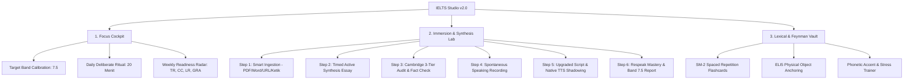

# 🏛️ IELTS Band 7.5+ Mastery Studio: PRD, SSD & AI Prompting Master Guide

> **Visi Produk**: Membangun kembali sistem latihan intensif IELTS ke standar akademik profesional tingkat Cambridge/IDP. Menghilangkan elemen *gimmick* (warna neon berlebihan, efek game yang mengganggu, konfeti berulang), menyatukan arsitektur kode menjadi modular dan tahan banting (*resilient*), serta memfokuskan seluruh alur latihan pada akuisisi aktif menuju **IELTS Band 7.5 - 8.5**.

---

## BAGIAN I: PRODUCT REQUIREMENT DOCUMENT (PRD)

### 1. Masalah pada Versi Sebelumnya (Post-Mortem v1.0)
1. **UI Terlalu Ramai (*Sensory Overload & Visual Clutter*)**:
   - Terlalu banyak kartu, gradien neon tajam, badge berkedip, dan tombol aksi yang membingungkan.
   - Tema *Dark Mode* dan *Light Mode* saling menimpa secara agresif melalui `!important` di CSS, menyebabkan elemen teks putih di atas latar putih (*white-on-white*).
2. **Kerapuhan Sesi & Hilangnya Progres**:
   - Tulisan esai panjang di Synthesis Lab hanya disimpan di memori RAM. Jika tab browser tertutup atau ter-*refresh*, esai pengguna hilang seketika.
3. **Penyebaran Modul yang Terlalu Luas (*Feature Creep*)**:
   - 7 tab berbeda (Roadmap 14 stages, Vocab Logger, Speaking Lab, Daily Affirmation, Synthesis Lab, AI Glitch Lab, Boss Arena) membuat pengguna bingung menentukan prioritas belajar harian.
4. **Ketergantungan API yang Memblokir Pengguna**:
   - Jika pengguna belum memasukkan Gemini API Key atau sedang offline, sebagian besar tombol evaluasi speaking melempar pesan error dan mengunci langkah berikutnya.

---

### 2. Filosofi Desain Versi Baru: *"Calm Editorial Academic"* (UI Tidak Lebay)
- **Aturan Warna 60-30-10 yang Tegas**:
  - **60% Latar Netral**: *Clean Ivory Paper* (`#fbfbfa` di mode terang) atau *Obsidian Slate* (`#0f1117` di mode gelap).
  - **30% Struktur Kartu**: Kartu putih bersih (`#ffffff`) dengan garis batas tipis teratur (`border: 1px solid #e5e7eb`), radius sudut sedang (`rounded-xl`), bayangan sangat halus (`shadow-sm`). Tanpa efek neon menyala (*no harsh glows*).
  - **10% Aksen Bermakna (Semantic Only)**:
    - *Deep Academic Indigo* (`#4338ca`) untuk fokus utama.
    - *Sage / Forest Emerald* (`#047857`) untuk keberhasilan / keselarasan fakta.
    - *Warm Ochre* (`#b45309`) untuk koreksi grammar & catatan examiner.
    - *Crimson Slate* (`#be123c`) untuk kesalahan fatal / distorsi fakta.
- **Tipografi Utama**:
  - *Serif Akademik Elegan* (seperti `Newsreader`, `Lora`, atau `Merriweather`) untuk teks bahan bacaan dan naskah esai, memberikan nuansa seperti membaca jurnal *The Economist* atau *The Guardian*.
  - *Sans-Serif Presisi* (`Inter` atau `Plus Jakarta Sans`) untuk label, tombol, dan instruksi.
  - *Monospace Bersih* (`JetBrains Mono`) untuk transkrip fonetik IPA, hitungan kata, dan token CEFR.

---

### 3. Tiga Pilar Modul Inti (Konsolidasi Terarah)

Alih-alih 7 tab yang membingungkan, aplikasi disederhanakan menjadi **3 Ruang Kerja Utama**:



#### Modul 1: The Focus Cockpit (Dashboard Harian Tenang)
- **Fungsi**: Pusat kendali harian tanpa distraksi.
- **Fitur Utama**:
  - *Daily Deliberate Task*: Satu kartu fokus per hari (contoh: "Synthesis Sesi #12: Macroeconomics & Automation").
  - *Diagnostic Radar (4 Kriteria IELTS)*:
    - **TR (Task Response)**: 7.5
    - **CC (Coherence & Cohesion)**: 7.0
    - **LR (Lexical Resource)**: 8.0
    - **GRA (Grammatical Range & Accuracy)**: 7.0
  - *Daily Affirmation & Vocal Warmup*: 1 kalimat afirmasi berkualitas tinggi yang diucapkan lantang sebelum mulai belajar untuk mengondisikan pita suara dan ritme bahasa Inggris.

#### Modul 2: Immersion & Synthesis Studio (Jantung Aplikasi)
Alur 6 Langkah Terintegrasi yang wajib memiliki **Auto-Save Draft di setiap ketikan**:
1. **Langkah 1 (Reading Ingestion & Extraction)**:
   - Input: Teks langsung, File PDF/DOCX (diparsing lokal di browser), atau tautan artikel.
   - AI mengidentifikasi: Judul, Topik IELTS, Ringkasan Intisari (2 paragraf), dan 6-8 kata kunci C1/C2 lengkap dengan panduan tekanan suku kata lidah Indonesia (`🗣️ MI-ti-geit ↘`).
   - 1-Klik simpan kata ke *Lexical Vault*.
2. **Langkah 2 (Active Synthesis Essay)**:
   - Menulis paraphrase & sintesis opini dalam 150-250 kata.
   - *Live Target Vocab Checklist*: Chip kosakata berubah menjadi centang hijau saat digunakan secara akurat dalam esai.
   - *Auto-Drafting*: Disimpan otomatis ke storage lokal setiap 2 detik.
3. **Langkah 3 (Cambridge 3-Tier Audit & Fact Alignment)**:
   - **Audit Keselarasan Fakta**: Memastikan esai tidak mendistorsi isi bahan bacaan.
   - **Anti-Hallucination Guard**: Menolak teks asal-asalan (*gibberish*).
   - **Tier 1**: Teks asli siswa.
   - **Tier 2**: Koreksi tata bahasa baku (*Grammatical Precision*).
   - **Tier 3**: Transformasi IELTS Band 7.5+ (*Complex Sentences, Academic Collocations*).
   - **Speaking Anchors**: 3-4 frasa kunci untuk latihan bicara selanjutnya.
4. **Langkah 4 (Spontaneous Speaking)**:
   - Merekam opini lisan selama 60-90 detik tanpa membaca naskah.
   - Transkripsi suara via Gemini Multimodal Audio (atau fallback rekaman lokal jika offline).
5. **Langkah 5 (Upgraded Script & Native TTS Shadowing)**:
   - Naskah upgrade percakapan dengan penanda jeda napas (`/`) dan tekanan kata (`CAPS`).
   - **FITUR KRUSIAL**: Tombol **"Dengarkan Pelafalan Native (TTS)"** untuk latihan *shadowing* meniru ritme penutur asli sebelum merekam ulang.
6. **Langkah 6 (Targeted Respeak & Final Diagnostic Card)**:
   - Merekam ulang naskah upgrade.
   - AI membandingkan Rekaman 1 vs Rekaman 2: Peningkatan kelancaran (*Fluency Delta*), audit aksen target (British RP / US), dan penerbitan Rapor Sesi akhir yang tersimpan permanen di Logbook.

#### Modul 3: Lexical & Feynman Vault (Bank Kosakata)
- **Spaced Repetition (Algoritma SM-2 Terkalibrasi)**: Menghitung tanggal tinjau otomatis (1 hari, 3 hari, 7 hari, 14 hari, 30 hari).
- **Metode Feynman Sederhana (ELI5)**: Pengguna ditantang menjelaskan makna kata menggunakan analogi benda fisik sehari-hari (sesuai *Language Pedagogy Rules*), bukan menghafal definisi kamus yang rumit.
- **Pronunciation Coach**: Pelatihan vokal dengan panduan kontur nada dan penekanan suku kata.

---

## BAGIAN II: SOFTWARE SYSTEM DESIGN (SSD)

### 1. Pilihan Teknologi (Lightweight, Single-Page, No Build Clutter)
Untuk menjaga kemudahan deploy dan tidak memerlukan server backend yang rumit:
- **Core**: Vanilla Modern JavaScript (ES6+ Modules) atau Vite + TypeScript minimalis.
- **Styling**: Tailwind CSS v3 (atau CSS terkompilasi) dengan sistem CSS Variables terpadu untuk Light/Dark mode.
- **Local Document Parsers**:
  - `pdf.js` untuk file PDF.
  - `mammoth.js` untuk file DOCX.
- **Storage Engine**: `IndexedDB` (via pembungkus ringan seperti `idb-keyval`) sebagai pengganti `localStorage` agar tidak terkena kuota limit 5MB untuk transkrip dan riwayat sesi.
- **Speech & Audio**:
  - Browser Native Web Speech API (`SpeechSynthesis`) yang dioptimalkan untuk aksen British/American.
  - Native `MediaRecorder` API (`audio/webm` atau `audio/mp4`).
- **AI Backend Gateway**:
  - Integrasi langsung Client-Side ke Google Gemini API (menggunakan model terkini seperti `gemini-2.5-flash` / `gemini-1.5-flash` untuk latensi rendah).

### 2. Arsitektur Modul Kode (Strict Separation of Concerns)

```text
/public
│
├── index.html                   # Shell HTML bersih (< 500 baris, hanya struktur semantik)
├── /css
│   ├── design-tokens.css        # Variabel warna, tipografi, dan spasi (No hardcoded colors)
│   └── app.css                  # Utilitas layout dan komponen akademik
│
├── /js
│   ├── app.js                   # Entry point, router tab, inisialisasi sistem
│   │
│   ├── /core
│   │   ├── store.js             # Single Source of Truth (State Management + Auto-Draft)
│   │   ├── gemini.js            # Gateway Gemini AI, retry logic, anti-hallucination parser
│   │   ├── audio-tts.js         # Unified TTS Engine & MediaRecorder controller
│   │   └── document-parser.js   # PDF & DOCX client-side text extractor
│   │
│   ├── /modules
│   │   ├── cockpit.js           # Render Focus Cockpit & Affirmation
│   │   ├── synthesis.js         # 6-Step Synthesis Studio Controller
│   │   └── lexical-vault.js     # Vocab Bank, SM-2 Engine, & Feynman Drills
│   │
│   └── /pedagogy
│       ├── prompts.js           # Seluruh system prompt terkonsentrasi di sini
│       └── heuristics.js        # Fallback offline jika API Key kosong/gagal jaringan
```

### 3. Standar State Management & Skema Data Terpadu

```javascript
// Struktur State Terpusat (Store.js)
const AppState = {
  user: {
    targetBand: 7.5,
    targetAccent: 'british_rp', // 'british_rp' | 'general_american'
    xp: 0,
    streakDays: 1
  },
  synthesisDraft: {
    activeSessionId: null,
    currentStep: 1,
    sourceType: 'direct', // 'direct' | 'file' | 'url'
    readingTitle: '',
    readingTopic: '',
    readingFullText: '',
    readingNotes: '',
    extractedVocabs: [], // [{ word, pos, cefr, meaningId, indonesianGuide, selected: true }]
    essayText: '',
    factualAudit: null,
    tierBreakdown: null,
    speak1AudioBlob: null,
    speak1Transcript: '',
    upgradedScript: '',
    speak2AudioBlob: null,
    finalReport: null,
    lastSavedTimestamp: Date.now()
  },
  vocabBank: [], // Array item SM-2
  logbook: []    // Riwayat sesi terselesaikan
};
```

---

## BAGIAN III: STRATEGI PROMPTING AI AGAR TIDAK KEHILANGAN KONTEKS

Masalah terbesar saat membangun aplikasi besar bersama AI coding assistant adalah **Context Rot** (AI lupa aturan sebelumnya, menimpa kode yang sudah jalan, atau membuat ulang fungsi dengan nama berbeda).

Berikut adalah strategi baku dan panduan langkah demi langkah (*Playbook*) yang harus Anda ikuti:

### 1. Prinsip "Architecture as Anchor" (Aturan Baku)
1. **Jangan Minta AI Mengerjakan Semuanya Sekaligus**:
   - Minta AI bekerja per satu modul kecil (misalnya: *"Hanya buatkan modul audio-tts.js"*).
2. **Gunakan Single Source of Truth untuk Prompt AI**:
   - Seluruh prompt sistem AI (Cambridge Examiner, Vocab Extraction, Speech Evaluation) **wajib berada di satu file terpisah (`prompts.js`)**, jangan disebar di dalam fungsi logika.
3. **Pemberian Konteks Singkat di Awal Setiap Sesi**:
   - Setiap kali memulai chat baru atau instruksi besar, berikan 3 baris pembuka ini:
     > *"Kita sedang membangun IELTS Band 7.5 Mastery Studio. Standar kita adalah UI Clean Academic (tidak lebay, no harsh glow), arsitektur modular ES6, state tersimpan di Store terpusat, dan evaluasi berbasis kriteria resmi Cambridge IELTS."*

---

### 2. Roadmap Prompting Langkah-demi-Langkah (Phase-by-Phase)

#### 🔹 Fase 1: Desain Token & Shell HTML Bersih
**Prompt Template**:
```markdown
Saya ingin membuat fondasi antarmuka untuk IELTS Band 7.5 Studio.
Buatkan file `index.html` dan `design-tokens.css` dengan kriteria:
1. Desain 'Calm Editorial Academic': tidak lebay, tanpa gradien neon berlebih, latar #fbfbfa (light) dan #0f1117 (dark), kartu putih bersih dengan border tipis halus (#e5e7eb).
2. Layout mencakup: Header minimalis (Target Band, Aksen, Tombol Setting) dan Navigasi 3 Tab: Focus Cockpit, Synthesis Studio, dan Lexical Vault.
3. Gunakan font 'Newsreader' (serif) untuk naskah bacaan dan 'Inter' / 'Plus Jakarta Sans' untuk antarmuka.
4. Berikan container kosong untuk 3 tab tersebut tanpa JavaScript logika dulu. Kode harus semantik, rapi, dan mudah dibaca.
```

#### 🔹 Fase 2: Store Terpusat & Auto-Drafting Engine
**Prompt Template**:
```markdown
Sekarang buatkan `store.js` untuk manajemen state aplikasi.
Persyaratan:
1. Gunakan pola reactive store sederhana atau Pub/Sub dalam Vanilla JS.
2. Kelola state untuk user profile, draft aktif Synthesis Studio, Vocab Bank, dan Logbook.
3. Implementasikan fungsi Auto-Save ke localStorage/IndexedDB setiap kali state esai atau catatan diperbarui.
4. Buat fungsi `loadDraft()` yang otomatis memulihkan pekerjaan pengguna jika tab browser ter-refresh secara tidak sengaja.
```

#### 🔹 Fase 3: Audio & TTS Engine Terpadu
**Prompt Template**:
```markdown
Buatkan file `audio-tts.js` yang menjadi modul suara tunggal untuk seluruh aplikasi:
1. Pembungkus `window.speechSynthesis` dengan dukungan pergantian aksen: British RP (`en-GB`) dan American English (`en-US`).
2. Fungsi `playTTS(text, accent)` yang membatalkan audio sebelumnya sebelum berbicara, dengan kontrol laju bicara yang natural (rate: 0.95 untuk academic clarity).
3. Pembungkus `MediaRecorder` untuk merekam suara mikrofon siswa, menghasilkan Audio Blob (`audio/webm`), dan mengembalikan durasi waktu serta gelombang visualizer sederhana.
4. Penanganan error jika mikrofon ditolak atau browser tidak mendukung TTS.
```

#### 🔹 Fase 4: Synthesis Studio (Langkah 1 - 3: Input, Esai & Audit Fakta)
**Prompt Template**:
```markdown
Implementasikan Langkah 1 sampai Langkah 3 pada `synthesis.js`:
1. Langkah 1: Drag-and-drop PDF (pakai PDF.js), DOCX (pakai Mammoth.js), dan URL web reader.
2. Hubungkan dengan Gemini API untuk mengekstrak Judul, Kategori Topik, Intisari 2 paragraf, dan 6 kosakata C1/C2 lengkap dengan arti Indonesia dan panduan suku kata ala lidah Indonesia.
3. Langkah 2: Textarea esai dengan penghitung kata dan live checklist kosakata target yang otomatis mencentang hijau secara real-time saat kata tersebut diketik.
4. Langkah 3: Evaluasi esai dengan kartu 'Audit Keselarasan Fakta' (memastikan esai tidak menyimpang dari bacaan), perlindungan Anti-Gibberish (menolak teks ngawur), koreksi Tier 2, dan peningkatan kalimat Tier 3 (Band 7.5+).
5. Sediakan fallback lokal jika user tidak memiliki API key sehingga alur tidak pernah macet.
```

#### 🔹 Fase 5: Synthesis Studio (Langkah 4 - 6: Speaking & Shadowing)
**Prompt Template**:
```markdown
Lanjutkan `synthesis.js` untuk Langkah 4 sampai Langkah 6:
1. Langkah 4: Rekam suara spontan siswa (60-90 detik), kirim audio ke Gemini multimodal untuk transkripsi dan penilaian awal.
2. Langkah 5: Tampilkan naskah upgrade dengan tanda jeda napas (/) dan penekanan suku kata (CAPS). Tambahkan tombol 'Dengarkan Native TTS' menggunakan modul `audio-tts.js` untuk latihan shadowing.
3. Langkah 6: Rekam ulang (Respeak). AI membandingkan Rekaman 1 vs Rekaman 2, menampilkan Fluency Delta, Audit Karakteristik Aksen, dan menerbitkan Rapor Sesi akhir yang disimpan ke Logbook di `store.js`.
```

#### 🔹 Fase 6: Lexical & Feynman Vault (SM-2 SRS)
**Prompt Template**:
```markdown
Buatkan modul `lexical-vault.js`:
1. Tampilkan kartu kosakata dengan filter status (Belum Dipelajari, Sedang Diulang, Dikuasai) dan tingkat CEFR.
2. Fitur latihan harian berbasis Spaced Repetition Algoritma SM-2 (jadwal 1, 3, 7, 14, 30 hari).
3. Sesi Ujian Feynman (ELI5): Siswa mengetik penjelasan makna kata dengan analogi benda fisik sehari-hari. AI menilai apakah penjelasannya konkret dan mudah dipahami anak kecil.
```

---

### 3. Template Prompt Emas Saat Menemukan Bug / Ingin Mengubah Fitur
Jika ada error atau Anda ingin mengubah sesuatu, **jangan gunakan instruksi umum** seperti *"Tolong benerin dong, ini eror"*. Gunakan template ini:

```markdown
[Konteks File]: public/js/synthesis.js baris 120-160
[Gejala Masalah]: Tombol 'Ambil Teks URL' macet dan loading terus jika URL berasal dari BBC.
[Hasil yang Diharapkan]: 
1. Berikan timeout 6 detik pada fetch.
2. Jika proxy allorigins gagal, coba fallback proxy kedua atau tampilkan pesan ramah: 'Situs ini diproteksi, silakan tempel teks langsung'.
3. Pastikan state tombol loading dinonaktifkan kembali di blok `finally`.
[Batasan]: Jangan ubah fungsi lain di luar `fetchSynthesisUrlArticle`.
```

---

## 🎯 Kesimpulan & Rekomendasi Eksekusi
Dengan membagi sistem ke dalam 3 ruang kerja terarah, memisahkan logika ke dalam modul mandiri (*single responsibility*), dan mematuhi prinsip desain *Calm Academic*, aplikasi ini akan bertransformasi dari sekadar "alat belajar eksperimental yang ramai" menjadi **Cockpit Persiapan IELTS Band 7.5 Profesional kelas dunia** yang tenang, stabil, dan benar-benar melatih memori otot bahasa Inggris Anda.
